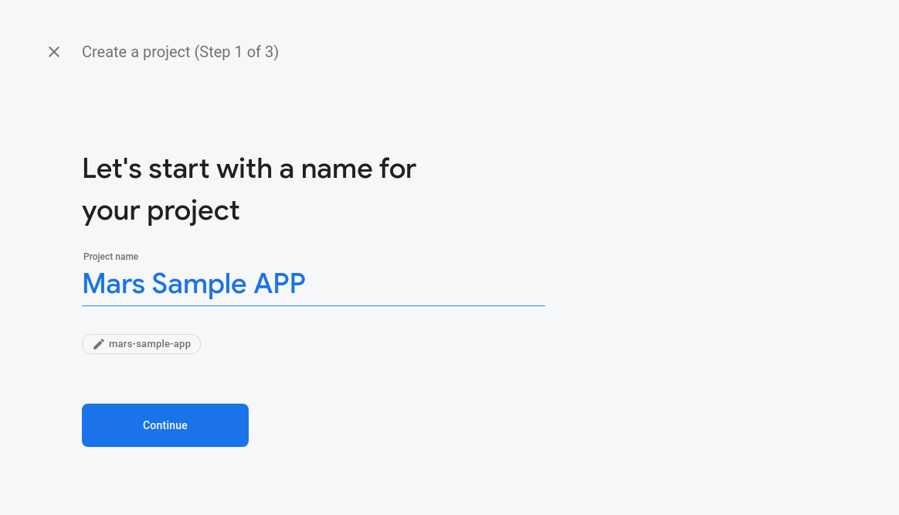
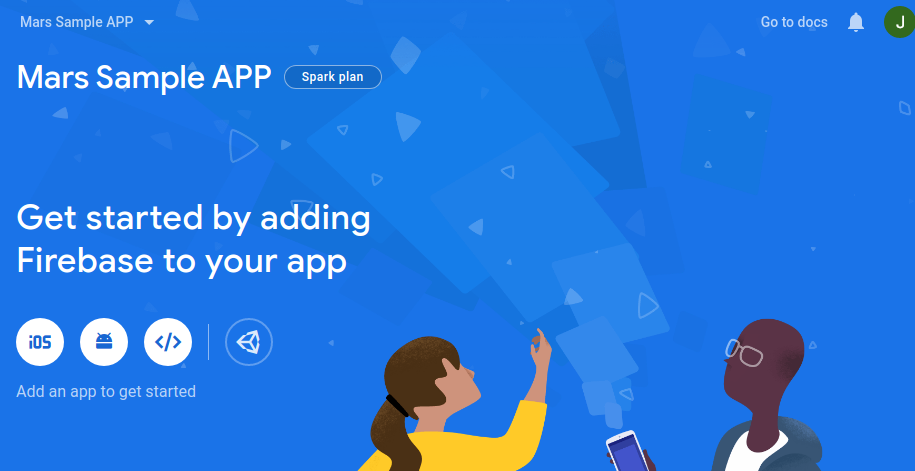
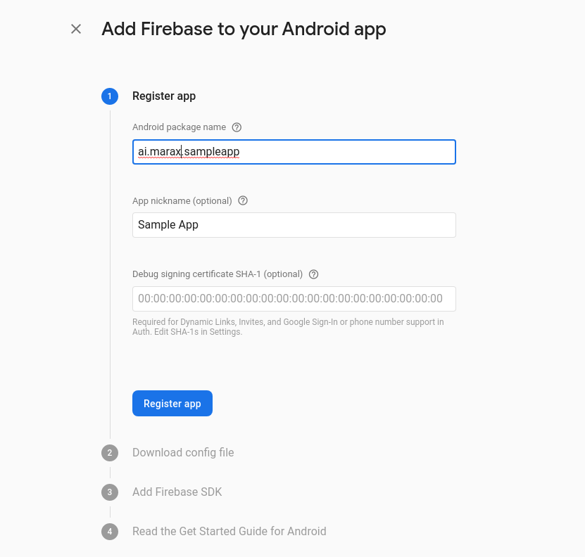
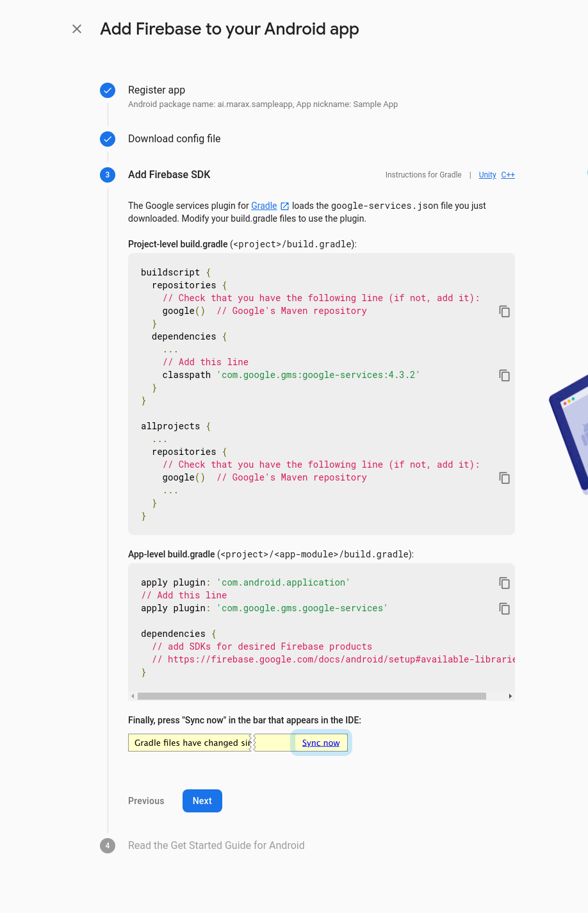
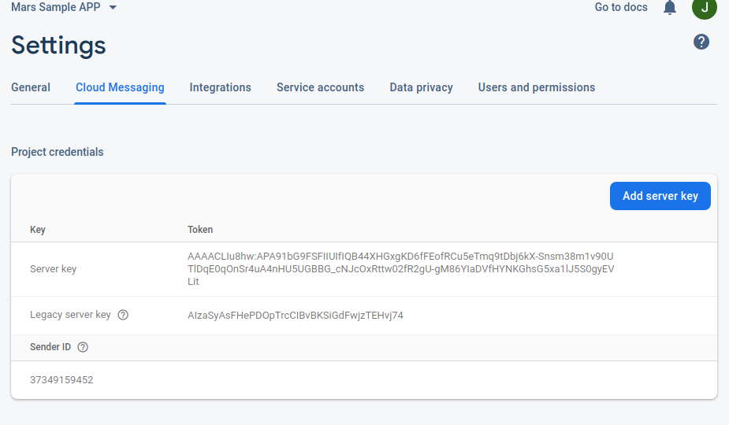

# mars-sdk-android

Users
- API version: 0.1.0
  - Build date: 2019-12-20T11:49:25.649Z[GMT]

API to register user device

## Requirements

Building the API client library requires:
1. Java 1.7+
2. Maven/Gradle

## Installation

To install the API client library to your local Maven repository, simply execute:

```shell
mvn clean install
```

To deploy it to a remote Maven repository instead, configure the settings of the repository and execute:

```shell
mvn clean deploy
```

Refer to the [OSSRH Guide](http://central.sonatype.org/pages/ossrh-guide.html) for more information.

### Maven users

Add this dependency to your project's POM:

```xml
<dependency>
  <groupId>io.swagger</groupId>
  <artifactId>swagger-java-client</artifactId>
  <version>1.0.0</version>
  <scope>compile</scope>
</dependency>
```

### Gradle users

Add this dependency to your project's build file:

```groovy
compile "io.swagger:swagger-java-client:1.0.0"
```

### Others

At first generate the JAR by executing:

```shell
mvn clean package
```

Then manually install the following JARs:

* `target/swagger-java-client-1.0.0.jar`
* `target/lib/*.jar`

## Getting Started

Please follow the [installation](#installation) instruction and execute the following Java code:

```java
import io.swagger.client.*;
import io.swagger.client.auth.*;
import io.swagger.client.model.*;
import io.swagger.client.api.UserApi;

import java.io.File;
import java.util.*;

public class UserApiExample {

    public static void main(String[] args) {
        
        UserApi apiInstance = new UserApi();
        Body2 body = new Body2(); // Body2 | 
        try {
            InlineResponse2002 result = apiInstance.registerDeviceToken(body);
            System.out.println(result);
        } catch (ApiException e) {
            System.err.println("Exception when calling UserApi#registerDeviceToken");
            e.printStackTrace();
        }
    }
}
import io.swagger.client.*;
import io.swagger.client.auth.*;
import io.swagger.client.model.*;
import io.swagger.client.api.UserApi;

import java.io.File;
import java.util.*;

public class UserApiExample {

    public static void main(String[] args) {
        
        UserApi apiInstance = new UserApi();
        Body1 body = new Body1(); // Body1 | 
        try {
            InlineResponse2001 result = apiInstance.updateDeviceToken(body);
            System.out.println(result);
        } catch (ApiException e) {
            System.err.println("Exception when calling UserApi#updateDeviceToken");
            e.printStackTrace();
        }
    }
}
```

### Firebase Integration
Add following code to your firebase messaging service  class and overide the onNewToken method
```
import com.google.firebase.iid.FirebaseInstanceId;
import io.swagger.client.ApiException;
import io.swagger.client.api.UserApi;
import io.swagger.client.model.Body2;
import io.swagger.client.model.InlineResponse2002;

    @Override
    public void onNewToken(String token) {
        sendRegistrationToServer(token);
    }
```
Implement the sendRegistrationToServer()
```
private void sendRegistrationToServer(String token) {
        UserApi userInstance = new UserApi();
        Body2 newUserBody = new Body2();
        newUserBody.setToken(token);
        newUserBody.setDeviceId(FirebaseInstanceId.getInstance().getId());

        try {
            InlineResponse2002 res = userInstance.registerDeviceToken(newUserBody);

        } catch (ApiException e) {
            System.err.println("");
            e.printStackTrace();
        }

    }

```

## Documentation for API Endpoints

All URIs are relative to *https://sdk-test.marax.ai/sdk/v1*

Class | Method | HTTP request | Description
------------ | ------------- | ------------- | -------------
*UserApi* | [**registerDeviceToken**](docs/UserApi.md#registerDeviceToken) | **POST** /user/firebase/android | Register a new device
*UserApi* | [**updateDeviceToken**](docs/UserApi.md#updateDeviceToken) | **PUT** /user/firebase/android | Update the firebase token for a device
*UserOffersApi* | [**fetchOffer**](docs/UserOffersApi.md#fetchOffer) | **GET** /user-offer/{offerId}/{userId} | Fetch a single offer for user by offer id
*UserOffersApi* | [**paintOffer**](docs/UserOffersApi.md#paintOffer) | **GET** /user-offer/template/{templateId}/{userId} | 
*UserOffersApi* | [**updateOffer**](docs/UserOffersApi.md#updateOffer) | **PUT** /user-offer/{offerId}/{userId} | Update the offer details for the user

## Documentation for Models

 - [Body](docs/Body.md)
 - [Body1](docs/Body1.md)
 - [Body2](docs/Body2.md)
 - [InlineResponse200](docs/InlineResponse200.md)
 - [InlineResponse2001](docs/InlineResponse2001.md)
 - [InlineResponse2002](docs/InlineResponse2002.md)
 - [InlineResponse2002Data](docs/InlineResponse2002Data.md)
 - [User](docs/User.md)
 - [UserAttributes](docs/UserAttributes.md)
 - [UserCompliances](docs/UserCompliances.md)
 - [UserCompliancesGdpr](docs/UserCompliancesGdpr.md)
 - [UserOfferObject](docs/UserOfferObject.md)
 - [UserSdk](docs/UserSdk.md)
 - [UserSdkAndroid](docs/UserSdkAndroid.md)
 - [UserSdkFirebase](docs/UserSdkFirebase.md)

## Documentation for Authorization

All endpoints do not require authorization.
Authentication schemes defined for the API:


# Getting Started with Android SDK

  Mars SDK is dependent on following SDKs

- Firebase SDK

- Rudder SDK

  

1. **Integrate Firebase**

- Following steps assumes that an active Firebase project is available. If not, follow these [steps](https://firebase.google.com/docs/android/setup) steps to create a new firebase project

**Configuring Cloud Messaging in Firebase**

- Create a new project from firebase console




- Select ADD APP after entering the name.



- Add Firebase to your app

  When prompted, enter your application’s Package Name. This can be found in your AndroidManifest.xml file.

  ```
  <!--The package name is the string equal to "package" below-->
  <manifest xmlns:android="http://schemas.android.com/apk/res/android"
            package="ai.marax.sampleapp">
    
    ... 
  ```

  

  

  

- Follow instructions to add Firebase SDK to app

  

- Firebase will then generate a google-services.json file that you must add to your application’s “app” directory.

  [

  

Select the Cloud Messaging tab in your Settings. Here, you can find your Server Key to upload to Mars Dashboard 




**Integrating the Mars SDK with Firebase**

Find the firebaseMessagingService in your application and override onNewToken() 

```
/**
     * Called if InstanceID token is updated. This may occur if the security of
     * the previous token had been compromised. Note that this is called when the InstanceID token
     * is initially generated so this is where you would retrieve the token.
     */
    @Override
    public void onNewToken(String token) {
    
        // If you want to send messages to this application instance or
        // manage this apps subscriptions on the server side, send the
        // Instance ID token to your app server.
        sendRegistrationToServer(token); // add this line of code
    }
```

and implement the following function

```
import com.google.firebase.iid.FirebaseInstanceId;
import io.swagger.client.ApiException;
import io.swagger.client.api.UserApi;
import io.swagger.client.model.Body2;
import io.swagger.client.model.InlineResponse2002;

    private void sendRegistrationToServer(String token) {

        UserApi userInstance = new UserApi();
        Body2 newUserBody = new Body2();
        newUserBody.setToken(token);
        newUserBody.setDeviceId(FirebaseInstanceId.getInstance().getId());


        try {
            InlineResponse2002 res = userInstance.registerDeviceToken(newUserBody);
        } catch (ApiException e) {
            System.err.println("");
            e.printStackTrace();
        }

    }
```


**2. Integrate Rudder SDK**

**Dependencies**

1. Open your app/build.gradle (Module: app) file, add the following

```
repositories {
    maven {
        url  "https://dl.bintray.com/rudderstack/rudderstack"
    }
}
```

```
implementation 'com.rudderlabs.android.sdk:rudder-sdk-core:0.1.4'
// if you don't have Gson included already
implementation 'com.google.code.gson:gson:2.8.6'
```


1. It is recommended to have an Application class for Rudder SDK.  To create one, add a class like so

```
import android.app.Application;

import com.rudderlabs.android.sdk.core.RudderClient;
import com.rudderlabs.android.sdk.core.RudderConfig;
import com.rudderlabs.android.sdk.core.RudderLogger;

public class MainApplication extends Application {

	private static MainApplication instance;
    private static RudderClient rudderClient;
    private static final String writeKey = "YOUR-SDK-CLIENT_KEY";
    private static final String endPointUrl = "https://sdk-events.marax.ai";
    
    @Override
    public void onCreate() {
        super.onCreate();
        
        RudderConfig config = new RudderConfig.Builder()
                .withEndPointUri(endPointUrl)
                .withLogLevel(RudderLogger.RudderLogLevel.VERBOSE)
                .build();

        instance = this;

        rudderClient = new RudderClient.Builder(this, writeKey)
                .withRudderConfig(config)
                .build();

        RudderClient.with(this).onIntegrationReady(writeKey, new RudderClient.Callback() {
            @Override
            public void onReady(Object instance) {
                Log.i("Status", "Rudder Integration is ready");
            }
        });

        RudderClient.setSingletonInstance(rudderClient);
    }
     public static RudderClient getRudderClient() {
        return rudderClient;
    }

    public static MainApplication getInstance() {
        return instance;
    }
}
```


Add following in your manifest

```
<application
    android:name=".MainApplication" // relative path to this class
    <!-- ... -->
</application>
```

**Track Events**:

To track an event add following code, call getRudderClient().track("EVENTNAME", "RUDDER_PROPERTIES") 

Eg:

```
Map<String,Object> properties = new HashMap<>();
properties.put("view_name", "HOME");
getRudderClient().track("HOME_OPENED", new RudderProperty().putValue(properties));
```

## Recommendation

It's recommended to create an instance of `ApiClient` per thread in a multithreaded environment to avoid any potential issues.

## Author

dev@marax.ai

